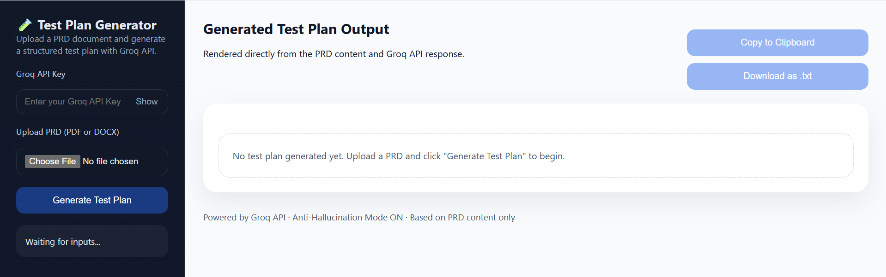
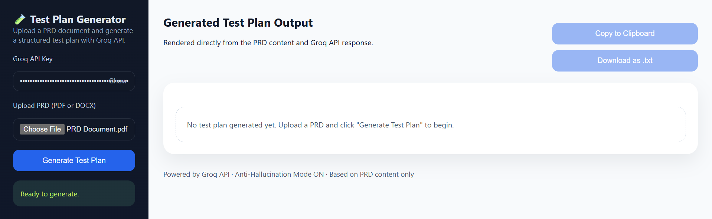
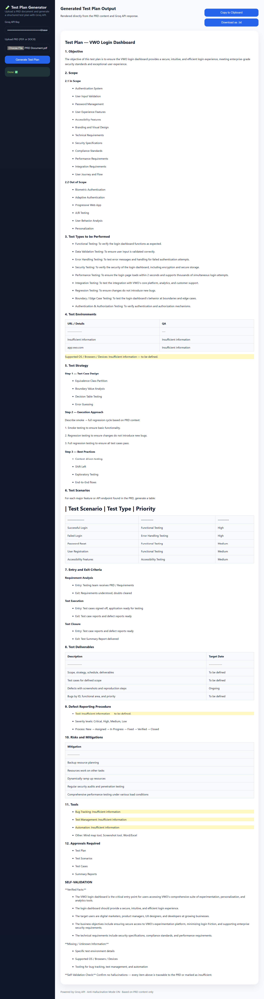

# 🚀 Test Plan Generator

An AI-powered tool designed to transform Product Requirement Documents (PRDs) into comprehensive, structured test plans. By leveraging the Groq API and strict anti-hallucination guidelines, this application ensures that the generated test plans are accurate, traceable, and professional.

## 🌟 Key Features

- **AI-Driven Generation**: Uses the high-performance Groq API to analyze PRDs and synthesize detailed test plans.
- **Strict Anti-Hallucination Engine**: Implemented based on professional QA verification rules to prevent the AI from inventing features or assuming system behaviors.
- **Industry-Standard Formatting**: Generates outputs following a professional test plan structure (inspired by the Restful Booker ATB12x standard).
- **Secure API Integration**: Requires a user-provided Groq API key for on-demand generation.
- **Easy Export**: Options to copy the generated plan to the clipboard or download it as a `.txt` file.

## 🛠 How It Works

### 🛡 Anti-Hallucination Rules
To ensure maximum reliability, the tool adheres to a strict verification framework:
- **Verifiable Facts Only**: The AI only uses information explicitly provided in the uploaded PRD.
- **No Assumptions**: Default or "typical" behaviors are never assumed.
- **Transparency**: If information is missing, the tool reports "Insufficient information to determine" rather than guessing.
- **Traceability**: Every assertion in the test plan is traceable back to the source document.

### 📄 Output Format
The generated test plans follow a structured template that includes:
- Test Objectives
- Scope (In-scope/Out-of-scope)
- Test Scenarios & Detailed Test Cases
- Expected Results
- Environment Requirements

## 🚀 Getting Started

1. **Launch Application**: Open the Test Plan Generator interface.
2. **API Configuration**: Enter your **Groq API Key** in the provided field.
3. **Upload PRD**: Upload your Product Requirement Document in **PDF** or **DOCX** format.
4. **Generate**: Click **"Generate Test Plan"**.
5. **Review & Export**: Review the rendered output and use the "Copy to Clipboard" or "Download as .txt" buttons to save your work.

## 📸 Application Gallery

### 1. Initial Load
The clean landing page where users start their session.

### 2. Ready to Generate
Once the Groq API key is entered and the PRD is uploaded, the system is ready.

### 3. Final Output
The final, structured test plan generated directly from the PRD content.

## 📜 Credits
- **Anti-Hallucination Framework**: Pramod Dutta (Principal SDET, The Testing Academy)
- **Powered by**: Groq API
