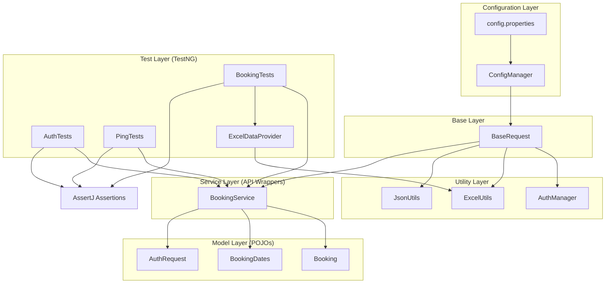

# The Testing Academy - AI Tester Blueprint 3x

This repository is a dedicated workspace for tracking learning progress, storing study materials, and submitting assignments for **The Testing Academy's AI Tester Blueprint 3x** course.

## 🎯 Purpose
The goal of this project is to document the journey of becoming an AI-powered tester, focusing on the integration of Large Language Models (LLMs) and AI Engineering into the software testing lifecycle.

## 📁 Repository Structure

```text
.
├── chapter_01_LLM_Basics/           # LLM Fundamentals & AI Engineering research
│   └── Tasks/                       # Course assignments, PRDs, and research reports
├── chapter_02_Prompt_Engg/           # Prompt Engineering Mastery
│   ├── Project1_TC_Gen/             # RICE-POT based Test Case Generation
│   └── Project2_Selenium_Framework/  # Advance Selenium Framework for Salesforce
├── Project_01_TestPlanGenerator/    # AI-Driven Test Plan Generation Tool
│   ├── docs/                       # Methodology and Anti-Hallucination rules
│   ├── output/                     # Generated Test Plans (e.g., VWO Login)
│   └── screenshots/                # Tool interface evidence
├── Project_02_REST_API_Framework/    # REST API Automation Project Hub
│   ├── 01_...prompt.md              # Framework generation prompts
│   ├── 02_...Test_Cases.md          # API Specification & Test Case Document
│   ├── 03_...Generation.md        # Test generation templates
│   ├── 04_...Rules.md               # Anti-hallucination guardrails
│   └── RICEPOT_RESTASSURED_API_Project # The implemented Java Framework
│       ├── .github/workflows/       # CI/CD pipeline definitions
│       └── src/
│           ├── main/java/com/ricepot/api/
│           │   ├── base/             # Request specifications
│           │   ├── config/          # Property management
│           │   ├── models/          # JSON POJOs
│           │   ├── services/         # API endpoint wrappers
│           │   └── utils/            # Data and Auth helpers
│           └── test/
│               ├── java/com/ricepot/api/
│               │   ├── dataProviders/ # External data loaders
│               │   └── tests/         # TestNG test suites
│               └── resources/
│                   ├── testdata/      # Excel/JSON/CSV data files
│                   └── config.properties # Environment configs
├── Project_03_BLAST_FW_TEST_STRATEGY/   # B.L.A.S.T. framework reference docs & planning
│   ├── B.L.A.S.T.md                 # System prompt / 5-phase build protocol
│   ├── RICE_POT.md                  # Prompt engineering framework reference
│   ├── TestStrategy_Template.md     # Template used by AI to structure output
│   ├── LLM.md                       # Project Constitution (schemas, rules, invariants)
│   ├── task_plan.md                 # Phase checklist
│   ├── findings.md                  # Discoveries & constraints log
│   └── progress.md                  # Work log
├── Project_03_BLAST_FW_JIRA_TS_AI_AGENT/  # BLAST Test Strategy Generator app
│   └── blast-test-strategy/         # React + Vite application
│       ├── src/
│       │   ├── components/          # SettingsPage, GeneratePage (with MarkdownRenderer)
│       │   ├── context/             # SettingsContext (credential state + localStorage)
│       │   └── services/            # jiraApi.js, groqApi.js
│       ├── vercel.json              # Jira CORS proxy rewrite for Vercel production
│       └── vite.config.js           # Jira CORS proxy for local dev
├── Notes.md                         # High-level summary of topics and milestones
└── CLAUDE.md                        # Guidance for AI assistants working in this repo
```

### 📖 Directory Guide
- **`chapter_01_LLM_Basics/`**: Focuses on foundation models, local LLM setup (Ollama/LM Studio), and AI engineering principles.
- **`chapter_02_Prompt_Engg/`**: Mastery of prompt engineering. Includes the application of the **RICE-POT** framework to generate test cases and advanced automation frameworks (Selenium/Salesforce).
- **`Project_01_TestPlanGenerator/`**: A specialized AI tool implementation designed to generate comprehensive test plans based on provided documentation, incorporating strict anti-hallucination rules.
- **`Project_02_REST_API_Framework/`**: The comprehensive implementation of a REST API framework using Rest Assured, demonstrating a complete SDET lifecycle from prompt to pipeline.
- **`src/main/java/...`**: The core framework logic, including POJOs for data mapping and Service classes for API interaction.
- **`src/test/java/...`**: The automation suites and data providers that execute the test cases.
- **`Project_03_BLAST_FW_TEST_STRATEGY/`**: Reference documentation and B.L.A.S.T. planning artifacts for Project 03.
- **`Project_03_BLAST_FW_JIRA_TS_AI_AGENT/`**: The deployed React application — fetches a Jira issue and auto-generates a full Test Strategy document using GROQ AI.

## 🏆 Completed Projects

### Project 01: Test Plan Generator
AI-powered tool to automate the creation of structured test plans.
- **Key Feature**: Integration of anti-hallucination rules to ensure generated test plans are 100% based on provided documentation.
- **Deliverable**: Generated Test Plan for VWO Login Dashboard.

### Project 03: BLAST Test Strategy Generator
AI agent that fetches a Jira issue and auto-generates a professional Test Strategy document in one click.

- **Live App**: [blast-test-strategy.vercel.app](https://blast-test-strategy.vercel.app)
- **Framework**: B.L.A.S.T. (Blueprint → Link → Architect → Stylize → Trigger) + RICE-POT
- **Stack**: React 19 + Vite 8, GROQ AI (`openai/gpt-oss-120b`), Jira REST API v3
- **Key Features**:
  - One-click workflow: enter Jira ID → fetch issue → GROQ generates strategy
  - Credentials auto-loaded from environment variables (zero manual setup)
  - Jira Cloud CORS bypassed via Vercel edge rewrite (`vercel.json`)
  - Formatted markdown output with download + clipboard copy
  - All 5 B.L.A.S.T. phases documented: `LLM.md`, `task_plan.md`, `findings.md`, `progress.md`

#### 🏗️ Architecture (3-Layer B.L.A.S.T.)
| Layer | Location | Role |
|---|---|---|
| SOPs | `Project_03_BLAST_FW_TEST_STRATEGY/` | Schema, rules, invariants |
| Navigation | `src/context/` + `src/App.jsx` | State, routing, credential management |
| Tools | `src/services/jiraApi.js` + `groqApi.js` | Atomic API calls |

#### 🛠️ Technical Stack
- **Frontend**: React 19, Vite 8
- **AI**: GROQ API (`openai/gpt-oss-120b` — free tier)
- **Integration**: Jira Cloud REST API v3 (Basic Auth)
- **Deployment**: Vercel (edge rewrite proxy for Jira CORS)

---

### Project 02: REST API Framework (RICE-POT)
Implementation of an enterprise-grade API automation framework for the Restful-Booker API.

#### 🗺️ Architectural Blueprint
The framework uses a strictly decoupled layered architecture:



#### 🛠️ Technical Stack
- **Language**: Java 17
- **HTTP Library**: Rest Assured 5.3.0
- **Test Runner**: TestNG 7.7.0
- **Assertions**: AssertJ 3.24.2
- **CI/CD**: GitHub Actions
- **Reporting**: Allure Report 2.24.0

#### 🛡️ Key Implementation Standards
- **Anti-Hallucination**: 100% traceability from API spec to test code.
- **Layered Isolation**: Logic separated into Config $\rightarrow$ Base $\rightarrow$ Utils $\rightarrow$ Models $\rightarrow$ Services $\rightarrow$ Tests.
- **Data Driven**: Integrated Apache POI for Excel-based test data.

---

## 📚 Learning Progress

### Chapter 1: LLM Basics
- **Foundation Models**: Understanding the core architecture of modern LLMs.
- **AI Engineering**: Introduction to building and prompting AI systems.
- **Local LLM Setup**: Installation and configuration of tools like **Ollama** and **LM Studio** for running models locally.
- **Deep Dives**: Analysis of the "Attention Is All You Need" paper and other foundational research.

### Chapter 2: Prompt Engineering
- **RICE-POT Framework**: Applying the Role-Instruction-Context-Example-Parameter-Output-Tone methodology for precise AI outputs.
- **Automation Scaling**: Transitioning from simple prompts to complex framework generation for Selenium and Rest Assured.

### Chapter 3: B.L.A.S.T. Framework & AI Agents
- **B.L.A.S.T. Protocol**: 5-phase deterministic build system (Blueprint → Link → Architect → Stylize → Trigger) for building reliable AI-powered tools.
- **A.N.T. Architecture**: 3-layer separation — SOPs (docs), Navigation (logic routing), Tools (atomic scripts).
- **Project 03 Deliverable**: Full-stack AI agent deployed to Vercel — connects Jira + GROQ to auto-generate Test Strategy documents from any issue key.
- **Vercel Deployment**: Edge proxy, environment variable management, production CI/CD via GitHub integration.

## 🛠️ Tools & Technologies Used
- **Local LLMs**: Ollama, LM Studio
- **Models**: Gemma 3 (4b), GROQ `openai/gpt-oss-120b`, and various open-source alternatives
- **Research**: ChatGPT, Perplexity AI
- **Automation**: Java, Rest Assured, TestNG, Maven, Selenium
- **Frontend**: React 19, Vite 8
- **Deployment**: Vercel
- **Integrations**: Jira Cloud REST API v3, GROQ API

---
*This repository is part of a personal development journey to master AI Testing.*
